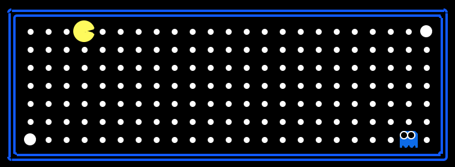
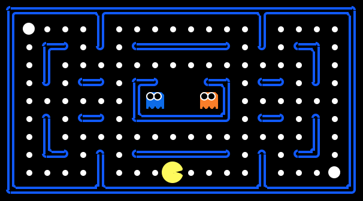
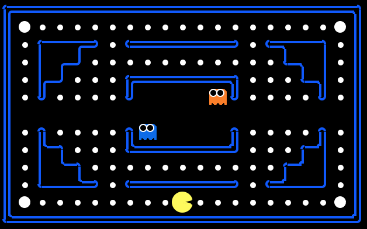
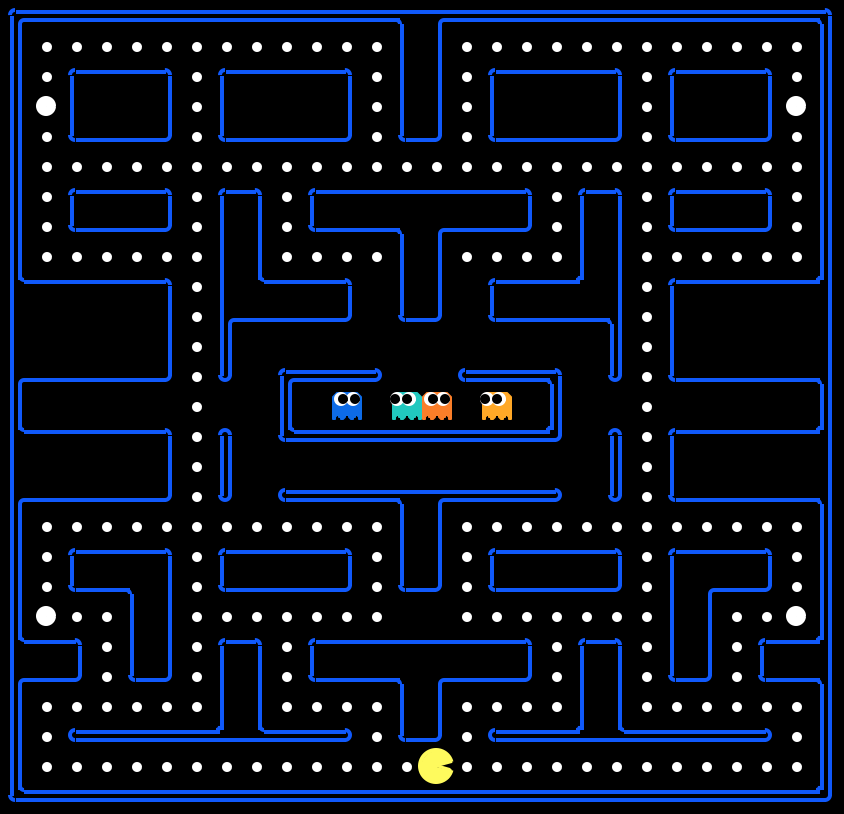

# B551-Pacman
This project is slightly modified from http://ai.berkeley.edu/multiagent.html, please clone this repository for developing and testing your agent.

You **do not** need to answer any question on that page, instead you need to turn in a file `B551Agents.py` which contains a agent named `B551Agent`, this repository already contains a very simple agent in `B551Agents.py` for you to get started. If you have other files please put them under a directory call `lib` and submit with `B551Agents.py`.

Your agent will be tested using the following five layouts:

`test1.lay`



`test2.lay`



`test3.lay`



`test4.lay`



`test5.lay`


For each layout your agent will fight aginst `DirectionalGhot` and `RandomGhost`, so there are 10 test cases, each is account for 10% of the grade of the program part (Note, the grading of program part and report part are seperated, so you still need to submit a report). For each test case, if you pacman died then you get 0%, if you pacman win then you will get 8%, and if you win with positive score you will get 10%. And for extra bonus, the agent which achieve highest score will receive additional 1%.

The test will be run on `silo.soic.indiana.edu`, the timeout is 3 seconds (i.e. your agent need to respond in 3 seconds for each move). Your agent will be tested using the following command:
```
python pacman.py -l test1 --timeout 3 -g RandomGhost -c -p B551Agent -t -f %seed% -r
python pacman.py -l test1 --timeout 3 -g DirectionalGhost -c -p B551Agent -t -f %seed% -r
```
Each case will be run with three different random seeds, only the best one counts.

To make sure every submission works smoothly, starting from April you can submit you agent every week and receive grades for `test1.lay`~`test4.lay`. The grade doesn't count but it will help you have better idea how your agent perform.

If you have any question about this project, feel free to send me an e-mail.
